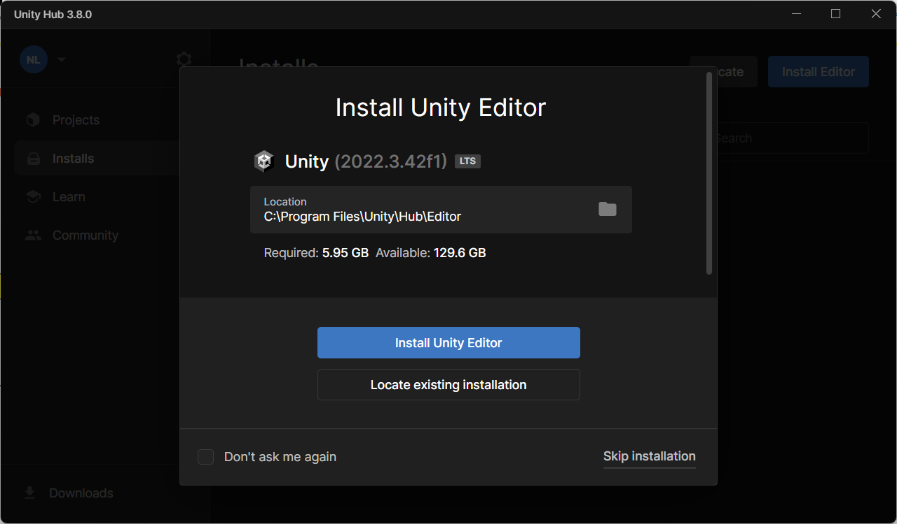

# Environment Setup steps:

1. Download Unity hub
https://unity.com/download

2. Install Unity hub and create account/sign in

3. Install Unity editor 2022.3.42f1

4. Download Visual Studio 2022
https://visualstudio.microsoft.com/thank-you-downloading-visual-studio/?sku=Community&channel=Release&version=VS2022&source=VSLandingPage&cid=2030&passive=false

5. Follow the instructions here to install the Unity support for Visual Studio
https://learn.microsoft.com/en-us/visualstudio/gamedev/unity/get-started/getting-started-with-visual-studio-tools-for-unity?pivots=windows
	- Visual Studio and Unity general documentation
https://learn.microsoft.com/en-us/visualstudio/gamedev/unity/get-started/visual-studio-tools-for-unity?pivots=windows

6. Open project solution with visual studio

